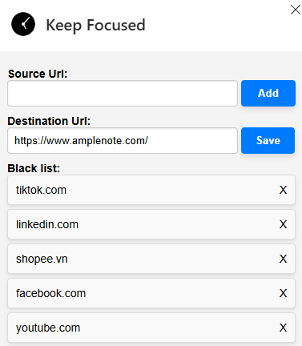

### **Build your own chrome extension to protect your productivity**
Ever find yourself lost in social media when you should be working and wish you could take back your time? Plenty of tools (like StayFocusd, Forest, and others) can help, but as a software engineer, why not create your own version inspired by these extensions? It's a lot more fun! In this article, I'll show you how I built my productivity extension, which I've named "Keep Focused."

The idea is simple: we create a "blacklist" of URLs to avoid, and whenever you visit one of these sites, the extension automatically redirects you to a more productive destination.

If you're new to building extensions, you might want to check out some beginner tutorials first. Here, we'll dive into using the **`declarativeNetRequest`** API.

The **`chrome.declarativeNetRequest`** API is used to block or modify network requests by specifying declarative rules. This lets extensions modify network requests without intercepting them and viewing their content, thus providing more privacy. [Learn more](https://developer.chrome.com/docs/extensions/reference/api/declarativeNetRequest)

#### **What You'll Need**
You can check out the full source code in this [Github Repo](https://github.com/kietly2k/keep-focused).

Before we begin, make sure you have the following files ready:
1. `manifest.json` — This file contains the metadata for the Chrome extension.
2. `options.html` — The HTML file that defines the user interface for the extension's options page.
3. `options.js` — The JavaScript file that contains the logic for managing redirects and dynamically updating rules.
4. `style.css` — The CSS file that styles the options page.
5. `clock.png` — The icon for the extension.

The folder structure should look like this:
```md
keep-focused
├── icons
│   ├── clock.png // simple icon display in the browser
├── pages
│   ├── options.html // configuration UI
│   ├── options.js
│   ├── style.css
└── manifest.json // most important file
```

### **Step 1: Setting Up the Manifest File**

The `manifest.json` file is the backbone of any Chrome extension. It provides essential information such as the extension's name, version, description, permissions, and other settings. Here's what our manifest file looks like:

```json
{
  "name": "Keep Focused",
  "version": "0.0.0.1",
  "manifest_version": 3,
  "description": "An extension that I use to remind myself to stay on track.",
  "icons": {
    "50": "icons/clock.png"
  },
  "permissions": [
    "declarativeNetRequest"
  ],
  "host_permissions": [
    "<all_urls>"
  ],
  "options_ui": {
    "page": "pages/options.html"
  }
}
```

### **Step 2: Creating the Options Page**

The options page allows users to configure which URLs they want to redirect and where they should be redirected. 

#### **HTML (`options.html`)**
Here is the HTML code for the options page:

```html
<!DOCTYPE html>
<html lang="en">
<head>
    <meta charset="UTF-8" />
    <meta name="viewport" content="width=device-width, initial-scale=1.0" />
    <link rel="stylesheet" href="style.css" />
</head>
<body>
    <div class="input-container">
        <label for="sourceUrl">Source Url:</label>
        <input type="text" id="sourceUrl" />
        <input id="addUrl" type="button" class="button" value="Add" />
    </div>

    <div class="input-container">
        <label for="destUrl">Destination Url:</label>
        <input type="text" id="destUrl" />
        <input id="saveDestUrl" type="button" class="button" value="Save" disabled />
    </div>

    <div class="input-container">
        <label>Black list:</label>
        <ul id="blacklist"></ul>
    </div>

    <div id="successMessage" style="display: none">
        Settings saved successfully!
    </div>

    <script src="options.js"></script>
</body>
</html>
```

This page has fields for the source URL (the URL you want to block) and the destination URL (where the browser will be redirected). Users can add URLs to a blacklist and manage redirects dynamically.

### **Step 3: Adding the JavaScript Logic**

The `options.js` file contains the logic for managing the URL redirection rules. It interacts with Chrome's `declarativeNetRequest` API to dynamically add, update, and remove redirect rules. Here's the JavaScript code:

```javascript
let destUrl = "";

document.getElementById("addUrl").addEventListener("click", async () => {
    const newRule = await getNewRule();
    await chrome.declarativeNetRequest.updateDynamicRules({
        addRules: newRule,
    });
    showSuccessMessage();

    const sourceUrlCtrl = document.getElementById("sourceUrl");
    addUrlToList(sourceUrlCtrl.value.trim());
    sourceUrlCtrl.value = "";
});

document.getElementById("destUrl").addEventListener("keyup", async (event) => {
    const hasChanged = destUrl !== event.currentTarget.value;
    document.getElementById("saveDestUrl").disabled =
        event.currentTarget.value === "" || hasChanged === false;
});

document.getElementById("saveDestUrl").addEventListener("click", async (event) => {
    const oldRules = await chrome.declarativeNetRequest.getDynamicRules();
    const oldRuleIds = oldRules.map((rule) => rule.id);

    destUrl = document.getElementById("destUrl").value.trim();
    const newRules = oldRules.map((rule) => {
        rule.action.redirect.url = destUrl;
        return rule;
    });

    await chrome.declarativeNetRequest.updateDynamicRules({
        removeRuleIds: oldRuleIds,
        addRules: newRules,
    });

    showSuccessMessage();
    event.currentTarget.disabled = true;
});

// Additional utility functions
// ...
```

### **Step 4: Styling the Options Page**

The CSS file, `style.css`, provides a simple and clean design for the options page.

```css
body {
    font-family: Arial, sans-serif;
    margin: 20px;
    padding: 0;
    background-color: #f4f4f4;
    font-size: 14px;
}

a {
    cursor: pointer;
}

/* Style for labels and inputs */
label {
    display: block;
    width: 110px;
    margin-right: 10px;
    font-weight: bold;
}

input[type="text"] {
    padding: 8px;
    width: 75%;
    border: 1px solid #ccc;
    border-radius: 4px;
    box-shadow: inset 0 1px 2px rgba(0, 0, 0, 0.1);
}

.input-container {
    margin-bottom: 10px;
}

/* Style for blacklist list */
ul {
    list-style-type: none;
    padding: 0;
    margin: 0;
}

ul li {
    background: #f9f9f9;
    border: 1px solid #ddd;
    border-radius: 4px;
    padding: 10px;
    margin-bottom: 5px;
    box-shadow: 0 2px 4px rgba(0, 0, 0, 0.1);
    display: flex;
    justify-content: space-between;
}

/* Style for the save button */
.button {
    background-color: #007bff;
    color: white;
    border: none;
    border-radius: 4px;
    padding: 9px 18px;
    cursor: pointer;
    box-shadow: 0 4px 6px rgba(0, 0, 0, 0.1);
    transition: background-color 0.3s ease, box-shadow 0.3s ease;
    font-weight: bold;
}

.button:hover {
    background-color: #0056b3;
    box-shadow: 0 6px 8px rgba(0, 0, 0, 0.15);
}

.button:focus {
    outline: none;
    box-shadow: 0 0 0 2px rgba(38, 143, 255, 0.5);
}

.button:disabled {
    background-color: #ccc;
    color: #666;
    cursor: not-allowed;
    opacity: 0.6;
}

#successMessage {
    background-color: #28a745;
    color: white;
    padding: 10px;
    border-radius: 4px;
    text-align: center;
    margin-top: 10px;
    box-shadow: 0 4px 6px rgba(0, 0, 0, 0.1);
    transition: opacity 0.5s ease;
    opacity: 0;
}
```

### **Step 5: Testing Your Extension**

1. **Open Chrome and navigate to `chrome://extensions/`.**
2. **Enable "Developer mode"** at the top right corner.
3. Click on **"Load unpacked"** and select the folder containing your extension files.
4. You should now see the "Keep Focused" extension in your list of extensions. Open option page and try adding and removing URLs to see the redirection in action.



### **Enjoy your work**
Congratulations! You've created a simple but effective Chrome extension that helps you stay focused by redirecting distracting websites. This guide demonstrated how to use the `declarativeNetRequest` API to dynamically manage URL redirection rules, giving you more control over your browsing habits. Keep exploring and enhancing your extension to make it even more useful!